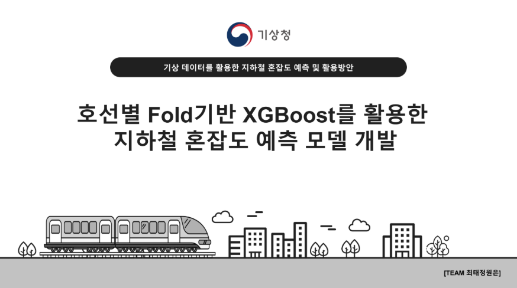
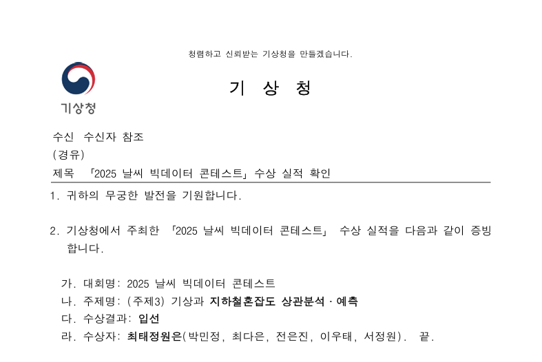
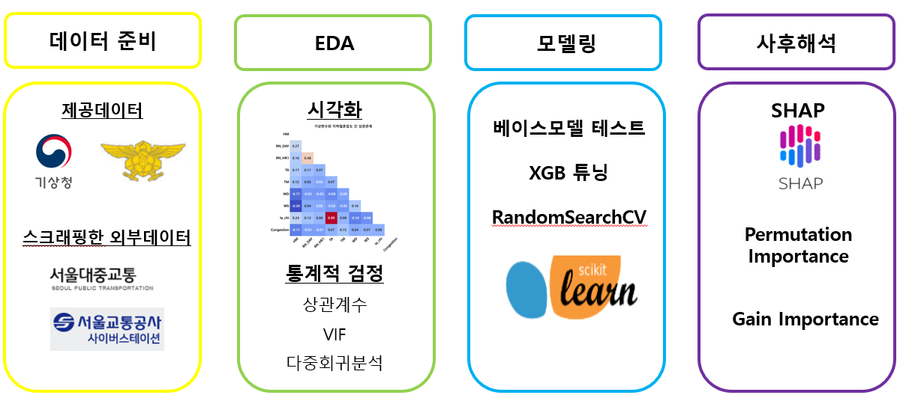
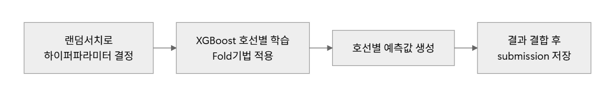

# 📌 2025년 날씨 빅데이터 콘테스트 : 입선작

* **프로젝트 기간** : 2025/05/19 \~ 2025/06/27
* **참가 규모** : 760개 팀 / 주제 3개
* **성과** : 모델 성능 상위 8위 달성, 입선
* **참가 주제** : 기사과 지하철 혼잡도 상관분석과 예측
  




---

## 1. 프로젝트의 목적

### 1-1. 문제 상황

* 폭우 시 지하철 혼잡도 **18.6% 증가**, 폭설 시 **15.3% 증가** → 기상상황 반영 필요
* 2025년 5월까지 전체 지하철 민원의 **75%가 냉난방 관련** → 냉난방 자동 제어 필요

### 1-2. 시장 조사

* 서울교통공사·SK텔레콤(2021) : 교통카드+통신데이터로 혼잡도 표준편차 **최대 30% 감소**
* 그러나 기상 변수·체감온도는 아직 반영되지 않음

### 1-3. 목적 및 기대효과

* 기상 변수를 반영한 지하철 혼잡도 예측 모델 구축
* 냉난방 시스템 연동, 전광판·앱 정보 제공, 반복 혼잡 패턴 식별, 교통 정책 근거 마련

### 1-4. 활용 기술

* **언어** : Python
* **분석** : EDA, 상관분석, 다중회귀, VIF
* **모델링** :

  * 최종 : **호선별 Fold 기반 XGBoost**
  * 시도 : LSTM, GRU, RNN, 멀티스트림, 연도별 전이학습

### 1-5. 수행 업무

* 외부 데이터 수집 (역 주소 스크래핑, 환승역 수기 입력)
* EDA 및 데이터 전처리 파이프라인 구축
* 통계 분석 및 가설 검정
* 모델링 및 성능 개선 (전이학습, 멀티스트림, 하이퍼파라미터 튜닝)

---
## 2. 결과(핵심코드 포함)
### 2-1. 프로젝트 구조도
  

- **EDA**
   - 🔗[상관분석, 다중회귀, VIF(다중공선성) 검정](code_py/EDA/은진_EDA.ipynb)

- **데이터 전처리** : 🔗 [전처리](https://github.com/silverjin7778/modeling-sme-fx-risk-ma)

- **모델링** : 
   **최종 모델 - 호선별 Fold XGBoost**
   
   

   - 🔗[하이퍼파라미터 튜닝](https://github.com/silverjin7778/modeling-2025-weather-bigdata-contest-award-subway-congestion-prediction-with-weather/blob/82e7028fe46e333bdb58ac6649a6bca3d84a27fa/code_py/models/final/%EB%AA%A8%EB%8D%B8_%ED%8A%9C%EB%8B%9D.py#L68-L120)

   - 🔗[호선별 fold XGBoost 학습](https://github.com/silverjin7778/modeling-2025-weather-bigdata-contest-award-subway-congestion-prediction-with-weather/blob/82e7028fe46e333bdb58ac6649a6bca3d84a27fa/code_py/models/final/%EC%B5%9C%EC%A2%85%EB%AA%A8%EB%8D%B8%ED%95%99%EC%8A%B5.py#L74-L150)

   🔗 [기각 모델 - 멀티스트림](https://github.com/silverjin7778/modeling-2025-weather-bigdata-contest-award-subway-congestion-prediction-with-weather/blob/82e7028fe46e333bdb58ac6649a6bca3d84a27fa/code_py/models/discarded/%EB%A9%80%ED%8B%B0%EC%8A%A4%ED%8A%B8%EB%A6%BC_%ED%95%98%EC%9D%B4%EB%B8%8C%EB%A6%AC%EB%93%9C_%EB%94%A5%EB%9F%AC%EB%8B%9D.py#L186-L224)

## 3. 이슈사항

### 모델링 과정에서

1. **가설: 딥러닝 구조가 데이터에 적합할 것이다. → 기각**

   * 2021~ 2023년 학습 시 R² 0.9 확보했으나, 2024년 예측에서 RMSE가 **20~200**으로 급격히 악화 -> 순위권에도 들지 못했음
   * 멀티스트림, 전이학습, Transformer 등 다양한 구조 시도 → 모두 성능 좋지 못함
   * 데이터 구조 자체가 딥러닝 구조의 모델로 풀기 부적합한 것 같음

2. **가설: 기상변수만으로도 혼잡도 예측이 가능할 것이다. → 기각**

   * 다중회귀분석 결과, 결정계수 **0.023**으로 설명력이 낮음
   * 변수별 방향성은 의미 있었으나, 기상변수 단일 예측으로는 불가능

3. **가설: 지하철역 단위 모델이 호선 단위보다 성능이 높을 것이다. → 미검증/제한**

   * 지하철역 단위 모델은 **300개 이상 필요**, 유지보수 부담이 커 현실적으로 시도 불가
   * 호선 단위 모델(8개)로 제한 → 모델 성능 개선을 위해 확장성 가능성은 있음

---
## 4. 데이터 설명
<details>
<summary>데이터 명세서</summary>

| No | 컬럼ID              | 컬럼명        | Type      | 내용                             | 비고 |
|----|---------------------|---------------|-----------|----------------------------------|------|
| 1  | TM                  | 측정시각      | datetime  | 데이터 수집 일시                  |      |
| 2  | Line                | 호선          | int/str   | 지하철 노선 번호                  |      |
| 3  | station_number      | 역 번호       | int       | 지하철 역 코드                    |      |
| 4  | station_name        | 역명          | str       | 지하철 역 이름                    |      |
| 5  | Direction           | 방향          | str       | 상행/하행/내선/외선 구분          |      |
| 6  | STN                 | 역 코드(약칭) | str       | 약칭 코드                         |      |
| 7  | TA                  | 기온          | float     | 일 평균 기온(°C)                  | 기상 |
| 8  | WD                  | 풍향          | float     | 풍향(degree)                      | 기상 |
| 9  | WS                  | 풍속          | float     | 평균 풍속(m/s)                    | 기상 |
| 10 | RN_DAY              | 일 강수량     | float     | 하루 총 강수량(mm)                | 기상 |
| 11 | RN_HR1              | 시간 강수량   | float     | 최근 1시간 강수량(mm)             | 기상 |
| 12 | HM                  | 습도          | float     | 평균 상대습도(%)                  | 기상 |
| 13 | ta_chi              | 체감온도      | float     | 체감온도(°C)                      | 기상 |
| 14 | Congestion          | 혼잡도        | float     | 열차 혼잡도(%)                    | 타겟 |
| 15 | 신설역              | 신설역 여부   | int/bool  | 해당 역이 신설역인지 여부          | 파생 |
| 16 | 신규관측소          | 신규관측소여부 | int/bool | 신규 기상관측소 여부               |파생 |
| 17 | transfer            | 환승역 여부   | int/bool  | 환승역(1) / 일반역(0)             | 수기 수집한 정보 |
| 18 | address             | 역 주소       | str       | 역 주소 정보                      | 스크래핑한 정보 |
| 19 | year                | 연도          | int       | 관측 연도                         | 파생 |
| 20 | month               | 월            | int       | 관측 월                           | 파생 |
| 21 | day                 | 일            | int       | 관측 일                           | 파생 |
| 22 | hour                | 시            | int       | 관측 시(hour)                     | 파생 |
| 23 | weekday             | 요일          | int       | 요일(0=월~6=일)                   | 파생 |
| 24 | week_of_month       | 월별 주차     | int       | 해당 월의 몇 번째 주인지           | 파생 |
| 25 | week_of_year        | 연간 주차     | int       | 해당 연도의 몇 번째 주인지         | 파생 |
| 26 | day_of_year         | 연간 일수     | int       | 해당 연도의 몇 번째 일인지         | 파생 |
| 27 | is_holiday          | 공휴일 여부   | int/bool  | 공휴일 여부                       | 파생 |
| 28 | is_day_before_holiday | 연휴 전날 여부 | int/bool | 공휴일 전날 여부                   | 파생 |
| 29 | is_day_after_holiday  | 연휴 다음날 여부 | int/bool | 공휴일 다음날 여부                 | 파생 |
| 30 | is_weekend          | 주말 여부     | int/bool  | 주말 여부                         | 파생 |
| 31 | time_period         | 시간대 구분   | category  | 출근/퇴근/일반 시간대 등           | 파생 |
| 32 | sin_hod             | 시간(sin)     | float     | 시간(hour of day) → sin 변환       | 주기 |
| 33 | cos_hod             | 시간(cos)     | float     | 시간(hour of day) → cos 변환       | 주기 |
| 34 | sin_dow             | 요일(sin)     | float     | 요일(day of week) → sin 변환       | 주기 |
| 35 | cos_dow             | 요일(cos)     | float     | 요일(day of week) → cos 변환       | 주기 |
| 36 | sin_dom             | 일(sin)       | float     | 일(day of month) → sin 변환        | 주기 |
| 37 | cos_dom             | 일(cos)       | float     | 일(day of month) → cos 변환        | 주기 |
| 38 | sin_wom             | 월 주차(sin)  | float     | 주차(week of month) → sin 변환     | 주기 |
| 39 | cos_wom             | 월 주차(cos)  | float     | 주차(week of month) → cos 변환     | 주기 |
| 40 | sin_woy             | 연 주차(sin)  | float     | 주차(week of year) → sin 변환      | 주기 |
| 41 | cos_woy             | 연 주차(cos)  | float     | 주차(week of year) → cos 변환      | 주기 |
| 42 | sin_doy             | 연 일수(sin)  | float     | 일(day of year) → sin 변환         | 주기 |
| 43 | cos_doy             | 연 일수(cos)  | float     | 일(day of year) → cos 변환         | 주기 |


</details>

---

## 5.  (가설 및 통계 분석)

1. **자연재해와 혼잡도는 연관이 있을 것이다. → 채택**

   * 황사 시 혼잡도 ↑, 태풍·한파 시 혼잡도 ↓

2. **기상변수만으로는 혼잡도 예측이 어렵다. → 채택**

   * 다중회귀분석 결과 설명력 낮음, 피처별 회귀계수의 개별 영향만 참고

3. **지역별로 혼잡도 분포가 다를 것이다. → 채택**

   * 관악구 평균 35 vs 강서구 평균 10

4. **시간대별 상·하행선 혼잡도가 다를 것이다. → 채택**

   * 출근(상행↑), 퇴근(하행↑) 뚜렷


---
## 6. 📁 파일 구조
``` 
project_name/

┣ code/                        # 분석 코드 및 모델
┃
┃ ┣ EDA/                       # 탐색적 데이터 분석
┃ ┃ ┣ 은진_EDA                      # 🟢 개인 (통계 검정, 가설 검정)
┃ ┃ ┣ 은진_자연재해연관_EDA         # 🟢 개인
┃
┃ ┣ data_collection/           # 데이터 수집 및 전처리
┃ ┃ ┣ 데이터전처리_파이프라인       # 🟢 개인
┃ ┃ ┣ 전처리용_EDA                # 🟢 개인
┃ ┃ ┗ 크롤링_역주소               # 🟢 개인
┃
┃ ┗ models/                    # 모델링
┃   ┣ discarded/               # 폐기된 시도 모델
┃   ┃ ┣ GRU, LSTM, 드롭아웃_테스트          # 🔵 공동
┃   ┃ ┣ 레이어층변경(1), (2)               # 🟢 개인
┃   ┃ ┣ 멀티스트림_하이브리드DL            # 🟢 개인
┃   ┃ ┗ 배치사이즈_테스트                  # 🔵 공동
┃
┃   ┗ final/                   # 최종 모델
┃     ┣ 모델튜닝
┃     ┣ 베이스라인_ARD&XGB                 # 🟢 개인
┃     ┣ 베이스라인_LGBM&CB                 # 🟢 개인
┃     ┗ 최종모델학습                        # 🟢 개인
┃
┣ data/                        # 공개 데이터
┃ ┣ address.csv                 # 스크래핑한 역 주소
┃ ┣ transfer.xlsx               # 환승역 수기 입력
┃ ┗ 자연재해/                   # 태풍, 폭염, 한파, 황사 일자
┃
┣ private_data/                 # 비공개 데이터
┃
┣ PPT.pptx                      # 최종 발표 자료
┣ PPT_요약본.pptx                # 발표 요약본
┗ README.md                     # 프로젝트 개요
```

---
## 7. 회고
1. **데이터 특성에 맞는 모델 선택의 중요성**

   * 시계열 구조 + 매우 큰 데이터 -> 딥러닝 구조가 맞다고 판단했음.
   * 다만, 같은 오후 1시여도 지하철역 개수별로 300여개의 데이터가 발생하는 문제가 있었음
   * 이는 타임스텝으로 시간 간격을 보다 넓게 주면 해결 가능할 것이라 생각했음.
   * 어느새 딥러닝 구조에 매몰되어버림
   * 결과가 목표에 못 미칠 경우, 지금까지의 투자(매몰비용)에 연연하지 않고 과감히 전환해야 함

2. **머신러닝 모델을 다양하게 시도하지 못한 점**

   * 딥러닝에 많은 시간을 소모한 탓에 머신러닝 시도는 약 2주에 그침
   * 다양한 머신러닝 기법을 충분히 실험하지 못한 것이 아쉬움으로 남음


3. **성장**
   * 기각된 가설이 많았지만, 이를 통해 다양한 모델 구조를 직접 실험하며 모델링 역량을 확장할 수 있었음

   * 공모전, 자격증 시험 2개, 시험, 프로젝트 2개를 병행하며 한계에 도전하는 기회였음

## 8. 🎤발표자료&공모안
   - 📑 [최종 발표 PPT](https://drive.google.com/file/d/1WLObxtBcTKxwIPEuFuITWHa3FCF5NvV6/view?usp=sharing)
   - 📑 [공모안](https://drive.google.com/file/d/18V-XlAoNAQG3lZJRKTIIU4LVicptoW-K/view?usp=sharing)
